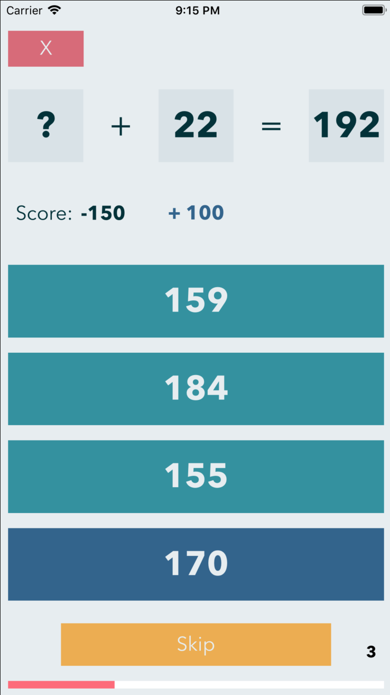

# MathTutor

An educational arithmetic quiz app, written in Swift for iOS.

## Deployment

Compatible with Xcode 9.4 and up.

## Features
 
MathTutor randomly generates timed quizes that pose addition, subtraction, multiplication or division problems. The user chooses which type of question they would like to answer, and then they are presented with an equation missing either the left hand side of the equation, the right hand side, or the solution. They are presented with four possible answers within buttons, one of which is the answer to the question. Clicking on the Correct answer scores the user 100 points, and then they are presented with a new questsion. Answering incorrectly subtracts 50 points from the users score before a new question is presented. 

The user is supplied with three skips per round as well, which can be used to clear an equation with no penalty, and present a new question.

The user can set the quiz duration to either one minute, three minute or five minutes from the setting section of the app.

A red progress bar is drawn in a rectangle at the bottom of the quiz screen, which displays the percent of time that has elapsed. The progress bar is drawn thirty times per second, so it increases as a smooth animation.

The top three scores for addition, subtraction, multiplication and division quizzes for each of the three durations are stored, and can be displayed in the scores section of the app.

When a quiz timer expires the user is presented with a game over screen, which shows their score, and allows them to restart the quiz, or navigate back to the home screen.

## Screenshots

*Main Menu*

*Settings*

*Scores*

*Addition*

*Subtraction*

*Multiplication*

*Division*

*Gameover*

*Incorrect guess*

*Correct guess*
